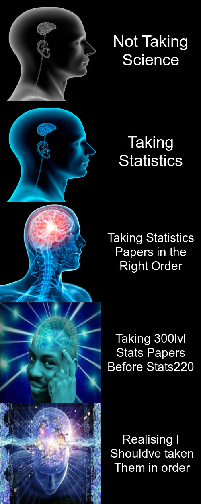

# Welcome to my Assignment 1
### *By: Jason Churches*


## Meme creation

The following meme was based off the expanding brain meme.
I based my idea off my personal experence of having done 300 level stats papers prior to taking stats220.
Now taking stats220 I have realised how much of a benefit it would have been to the assignments in the 300 lvl papers as r knowldege was assumed in those papers.

**I made the meme unique by:**
+ gathering unique images that fit the same theme of the original meme
+ creating a personal message to the meme from my own experiences




## Below is the R code used to create the meme
```{r}
library(magick)

#importing images for meme
small_brain <- image_read("https://i.imgflip.com/1lgr72.jpg?a457416") %>%
          image_scale("250x250!")

BOsmall_brain <- image_convert(small_brain, type = "Grayscale")

big_brain <- image_read("https://pyxis.nymag.com/v1/imgs/42d/c5a/53aaae864601cd024b2dd1fddaa6a0839a-15-exploding-brain-meme.rsquare.w700.jpg")%>%
          image_scale("250x250!") %>%
          image_flop()

smart_brain <- image_read("https://mat3e.github.io/brains/img/bonus/7.jpg") %>%
          image_scale("250x250!")

brain_explosion <- image_read("https://encrypted-tbn0.gstatic.com/images?q=tbn:ANd9GcRxFMUfaSBnYMP9RhlR5nRKM5R3f6S-31aBJA&usqp=CAU") %>%
          image_scale("250x250!")

#line one creation
science_text <- image_blank(width = 250, height = 250, color = "#000000") %>%
          image_annotate(text = "Not Taking\nScience", color = "#FFFFFF", size = 40, gravity = "center")

line1 <- c(BOsmall_brain, science_text) %>%
          image_append()

#line two creation
stats_text <- image_blank(width = 250, height = 250, color = "#000000") %>%
          image_annotate(text = "Taking\nStatistics", color = "#FFFFFF", size = 40, gravity = "center")

line2 <- c(small_brain, stats_text) %>%
          image_append()

#line three creation
order_text <- image_blank(width = 250, height = 250, color = "#000000") %>%
  image_annotate(text = "Taking Statistics\nPapers in the\nRight Order", color = "#FFFFFF", size = 30, gravity = "center")

line3 <- c(big_brain, order_text) %>%
  image_append()

#line four creation
wrong_text <- image_blank(width = 250, height = 250, color = "#000000") %>%
  image_annotate(text = "Taking 300lvl\nStats Papers\nBefore Stats220", color = "#FFFFFF", size = 30, gravity = "center")

line4 <- c(smart_brain, wrong_text) %>%
  image_append()

#line five creation
right_text <- image_blank(width = 250, height = 250, color = "#000000") %>%
  image_annotate(text = "Realising I\n Shouldve taken\n Them in order", color = "#FFFFFF", size = 30, gravity = "center")

line5 <- c(brain_explosion, right_text) %>%
  image_append()


#combined meme
meme <- c(line1, line2, line3, line4, line5) %>%
          image_append(stack = TRUE)

print(meme)
image_write(meme, "meme.png")

```
